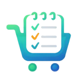

<h1 align="center">lista</h1>
<h1 align="center">
   
  
   
</h1>

<h4 align="center">The shopping app that needs to be</h4>

<h3 align="center">
    
</h3>

This project is an experiment in spec-driven development to determine whether current state-of-the-art of assisted development can produce applications with real usage relevance. The development of this codebase has been almost entirely generated by coding agents, however, with continuous review and steering by the human.

## Features

This is a shopping app like no other: control your shopping list via speech-to-text messages, extract ingredients from recipes, automatically sort shopping items by type and much more. Last but not the least, share your shopping list with others users and synchronise your shopping, never forget anything again!
